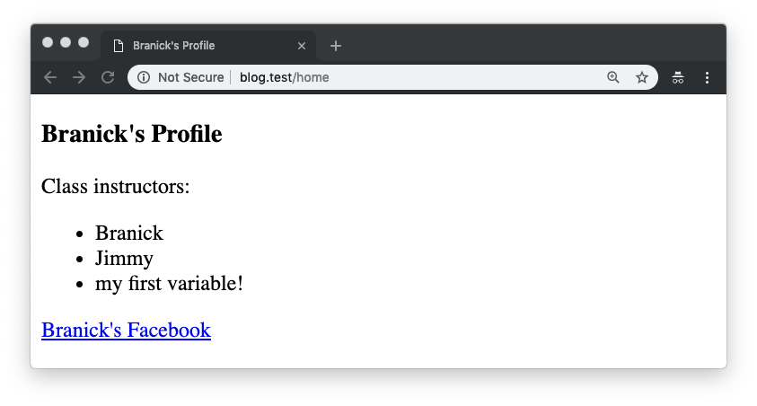

# Week 4 Notes:

Now that you've gotten Laravel installed, we are going to dive into setting up some routes and returning views. We'll take things step by step.

## Routes

### Locating Routes

This is one of the most important files in your application, it's the **main routing file**. This will define all of the possible routes in your application. If you look into your main code directly `blog` you will see the folder `routes/`, within that is your `web.php` file:


Open up web.php and you'll see a one starting function in there, just ignore it. This is the typical layout for `web.php` routes:

```php
Route::get('/route', 'NameOfController@method');
```

You'll see that we start with the keyword `Route` which denotes that we are now going to state a route. After the route is two `::` and then the type of route. Remember when we discussed types of requests? That's exactly what this is, here are the options following the CRUD design pattern:

- `GET` - used for simply returning a webpage. Ex: someone would get the homepage
- `POST` - used for creating an object/action. Ex: a user would post their login email and password
- `PUT` - used for updating an object. Ex: a user would update their profile picture
- `DELETE` - used for deleting something. Ex: a user would delete their facebook post

You can simply replace these keywords for the different types of routes then:

```php
Route::get('/route', 'NameOfController@show');
Route::put('/route', 'NameOfController@update');
Route::post('/route', 'NameOfController@store');
```

Now following the get we have a pair of parentheses `(` and `)` which encapsulate two items seperated by a commas `,`. The first item is `'/route'`, and this is the route we are defining as the route. For example, if someone where to go to `https://www.google.com/gmail/login` then the controller would look like this:

```php
Route::get('/gmail/login', 'LoginController@show');
```

Note that we don't include the domain on the actual route, this is handled automatically. In our applications we will be testing them locally by going to `project-name.test/route` in your browser. For this project called `blog` I can access it on `blog.test` in the browser with Valet, or potentially `blog.test:8000` if you're using Homestead.

The second part of this object is the `LoginController@show`, which itself has two parts broken up by the `@` sign. The first part is the name of the controller, and the second part is the method (function) that we will be using on the controller. In our gmail example, we are saying:

- Someone visits google.com/gmail/login (this is a `GET` request)
- Now go to the `LoginController` in the controllers folder (covered in next section)
- Now within the `LoginController`, find the function called `show` and return whatever that function returns (usually the `HTML` file)

## Controllers 

### Locating Controllers 

Controllers are located within the main `app/` folder and then within the `Http/` folder. You can see the file structure like this: 


### Creating Controller's

Now to start we don't have any controllers, you will need to create one. To do this, open up terminal and `cd` into your project directory, then run the command:

```bash
php artisan make:controller DashboardController
```


This command creates a controller called `DashboardController` automatically for you! Let's open it up then: 


You can see that in our navigation pane on the left we have a new file called `DashboardController`, and it's currently open in the viewer on the right. For now you can ignore almost everything in the file, just note that on `Line 8` there is a `{` and on `Line 10` there is a closing `}`. Between these two brackets we will add all of the functions defined in our `Web.php` routing file!

## Creating Route + Controller Method

Let's go into our `web.php` file and create a new route:

```php
Route::get('/home', 'DashboardController@show');
```

We are defining a `GET` route on `/home` that is now linked to new controller we made called `DashboardController`. It will then go into the `DashboardController` and find the `show` function. Now you will probably notice, there is no `show` function yet! Let's make that now:

### Creating Controller Method

This is what a new controller method looks like:

```php
    public function show(Request $request)
    {
        return ("<h1>this is my website!</h1>");
    }
```

The complete controller would now look like this: 


Before we break down what's happening, this is the final output if you now go to `blog.test/home`:


Let's break down exactly what is happening now. First, the user is going to the route `/home`, and the application sends them to the `DashboardController` and the `show` method on that. Inside the show method we are taking in a `$request` object of the Type `Request`. For this example, our method doesn't do anything besides return the string:

```html
<h1>
    this is my website!
</h1>
```

Normally we will return this HTML in a file (called Blade Views), but for now we are just returning it to the browser as RAW text for simplicity sake. Let's see what that would look like now.

## Views

Instead of returning `HTML`, we can create a `view` that the function can return. Our views are named like `name.blade.php`, but in reality you can think of these as `HTML` files. Laravel uses a templating system (called Blade), which we'll cover later.

### Locating Views

Views are located within the `resources/` folder and within the `views/` folder inside of that. See the navigation panel here:


You can see that we start with the `welcome.blade.php` file, which is Laravel's welcome page. Please check it out and you can see a lot of the content that we covered in Week 2 with `HTML`!

### Creating New Views

To create a new view, simply right click on the `views` folder and click "Create New". Name your new file: `profile.blade.php`


Let's now create an HTML document inside of this new `profile.blade.php` file. Remember: this is really just an HTML file:

```html
<!DOCTYPE html>
<html>
<head>
  <title>Branick's Profile</title>

  <style>
    /* Style Information */
  </style>

</head>

<body>
  <h3>Branick's Profile</h3>

  <p>
    Class instructors:
  </p>
  <ul>
    <li class="list_name big_font">Branick</li>
    <li class="list_name small_font">Jimmy</li>
  </ul>

  <a href="https://www.facebook.com/bdweix">Branick's Facebook</a>
</body>

</html>
```

Please make the web page into whatever you want! Now that we have this inside of the `profile.blade.php` file, we want the route `/home` to somehow return it to the user requesting the webpage. We can do this in the `DashboardController` `show` method as so:

```php
    public function show(Request $request)
    {
        return view('profile');
    }
```

The `view` function lets us return files within the `views` folder that we just made. Note: you don't need to specific the entire name of the file (in this case `profile.blade.php`), you can simply just put everything before the `.blade.php` part of the filename.

If the `view` was within a folder, we could access it as such:


The controller would now be:

```php
    public function show(Request $request)
    {
        return view('pages.profile');
    }
```

In this situation, the `pages.profile` says to go into the `pages` folder and find the file called `profile`. If we load our webpage it should now return this new HTML page:


## Passing Variables to Views

Now, as you noticed, techincally the view is a `.blade.php` file, not a `.html` file. This means that we can actually render variables in these pages. Let's first create a variable in our controller and pass it to the view:

```php
    public function show(Request $request)
    {
        $variableName = "My first variable!";
        return view('pages.profile', compact('variableName'));
    }
```

This looks like a lot at first, but let's break down what is happening. Anytime you see a `$` that means a variable is being declared, in this case our variable is called `variableName`. We are then setting that variable equal to `"My first variable!"`. We now need to pass this variable into the view, which we can do using the `compact` function. The `compact` function accepts the name of the variable (without the `$`)!. If we were to have multiple variables it would be passed within an array like this:

```php
    public function show(Request $request)
    {
        $var1 = "My first variable!";
        $var2 = "My second variable!";
        $var3 = "My third variable!";
        return view('pages.profile', compact(['var1', 'var2', 'var3']));
    }
```

Now if we reload the page you will notice it is exactly the same. What if we wanted to display this variable within the HTML? You can access this using `Blade` templating and **moustaches**. This are denoted by: `{{variable-name}}`. For example, if we wanted to display our $variableName in the list of items on our page, we would say this inside of the `profile.blade.php` file:

```php+HTML
  <ul>
    <li class="list_name big_font">Branick</li>
    <li class="list_name small_font">Jimmy</li>
    <li class="list_name small_font">{{$variableName}}</li>
  </ul>
```

The program will search through our `HTML` and look for a set of `{{ }}`. If it finds any moustaches, it will then look if it has the variable and if so replace it with what was passed through the `compact` function. Our new webpage looks like this: 

What you've just learned is extremely powerful! Start playing around and see what you can do.

## Blade 101 + Laracasts

Blade is a templating language that has a ton of features available to create powerful websites - believe it or not these simply features can build an interface just like Google, Facebook, and most other sites you use. Here's a great intro video that covers the basics: https://laracasts.com/series/laravel-5-fundamentals/episodes/5. You should be able to follow along and recognize all of the content quite easily! 

If you haven't yet, I'd recommend checking out Laracasts and seeing some of their other tutorials: https://laracasts.com

